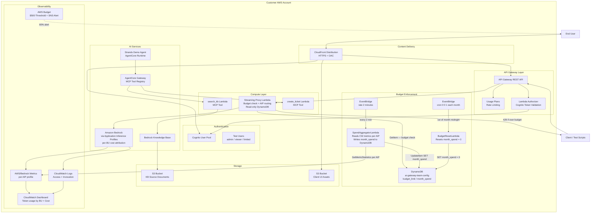
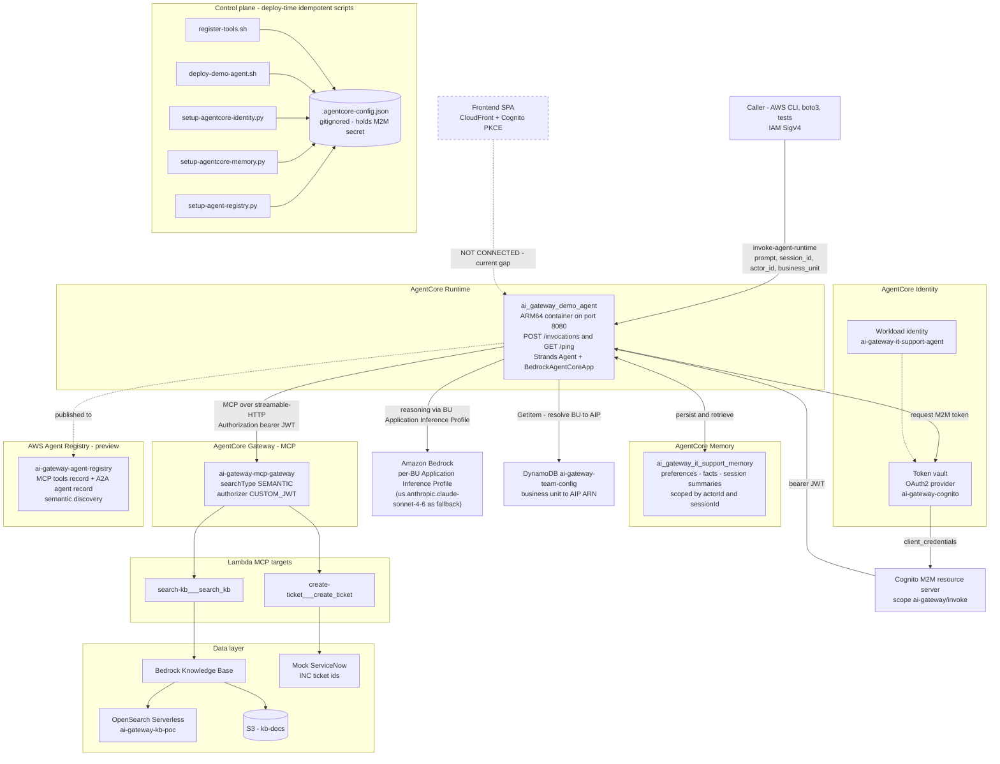
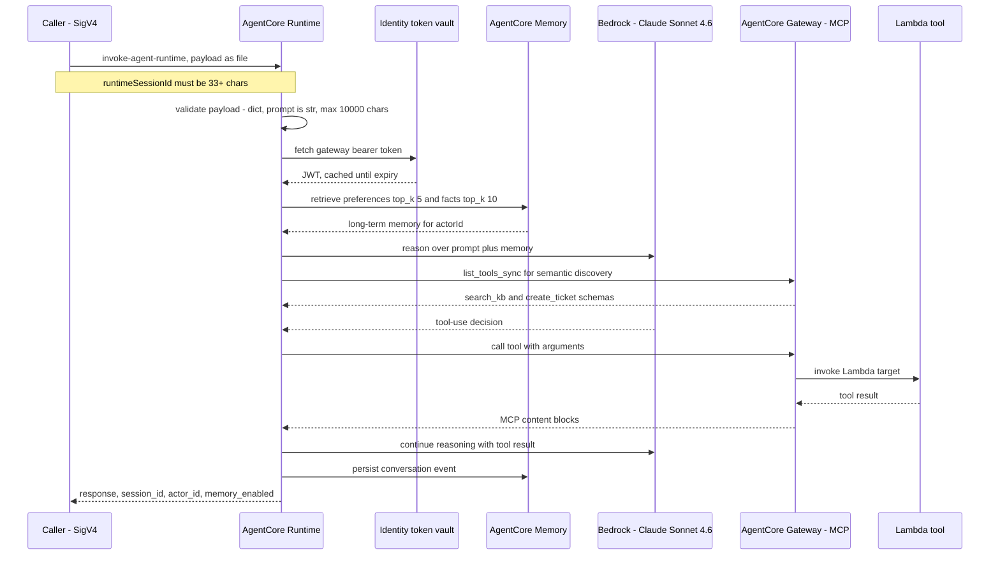

# Architecture: AI Gateway POC

## System Architecture


The diagram above shows the two invocation paths — browser/chat (blue) and developer/agent (gold) — and the observability plane (red dashed). See the data flow sections below for a step-by-step breakdown of each path.



## Data Flows

### Flow 1: Model Invocation

```
Client → API Gateway (rate limit check via Usage Plan)
       → Lambda Authorizer (Cognito token validation)
       → Sign-and-Forward Lambda (SigV4 signing)
       → Amazon Bedrock (model invocation with Project tags)
       → Response streamed back to client
```

The API Gateway enforces rate limits (100 req/min steady, 150 burst) before the request reaches the authorizer. The Lambda Authorizer validates the Cognito ID token and extracts user identity (username, team, role) into the request context. The Sign-and-Forward Lambda signs the request with SigV4 and forwards it to Bedrock. Invocation logging captures token counts, model ID, and latency to CloudWatch.

### Flow 2: Client UI Authentication (OAuth2/PKCE)

```
User → Client UI (CloudFront) → clicks "Sign In"
     → Redirect to Cognito Hosted UI (with PKCE code_challenge)
     → User authenticates (email + password)
     → Cognito redirects to /callback with authorization code
     → Client exchanges code + code_verifier for tokens (POST /oauth2/token)
     → ID token stored in browser
     → Subsequent API calls include Authorization: Bearer <id_token>
```

The Client UI uses OAuth2 authorization code flow with PKCE. No client secret is used (public SPA client). The Cognito Hosted UI handles all credential entry, password changes, and MFA. On first login, Cognito automatically prompts for a password change.

### Flow 3: MCP Tool Invocation

```
Demo Agent (Strands SDK) → AgentCore Gateway (semantic tool discovery)
                         → Lambda MCP Tool (search_kb or create_ticket)
                         → Tool response returned to agent
                         → Agent incorporates result into reasoning
```

The Strands demo agent connects to AgentCore Gateway for tool discovery. When the agent determines a tool is needed (e.g., KB search or ticket creation), it invokes the tool through the gateway. AgentCore records the invocation in trace logs with user identity.

> This is the summary view. See [AgentCore Architecture (Feature 4)](#agentcore-architecture-feature-4)
> for the full topology, the two auth planes, and the detailed invocation sequence.

### Flow 4: Cost Tracking and Budget Enforcement

```
Bedrock invocation → Invocation Logging enabled
                   → CloudWatch Logs (input tokens, output tokens, model ID, latency)
                   → CloudWatch Dashboard (aggregated metrics)

Per-BU spend aggregation (async, every 2 minutes):
  EventBridge rate(2 minutes) → SpendAggregatorLambda
    → DynamoDB Scan: build {team: [profile_ids]} dynamically
    → CloudWatch GetMetricStatistics per AIP profile (AWS/Bedrock namespace,
       InputTokenCount + OutputTokenCount, period = month-start → now)
    → Cost math per team (pricing from PRICING dict, mirrors bu-models.json)
    → DynamoDB UpdateItem: SET month_spend = total_cost, month_key = YYYY-MM

Per-request budget enforcement:
  Streaming Proxy Lambda (GetItem only, no writes):
    → if month_spend >= budget_limit → HTTP 429 (no Bedrock call, no cost)

Monthly reset:
  EventBridge cron(0 0 1 * ? *) → BudgetResetLambda
    → SET month_spend = 0, month_key = current month

Account-level cost:
  Bedrock Project (CostCenter: IT-Operations tag)
    → AWS Cost Explorer (tag-filtered costs)
    → AWS Budget ($500/month threshold)
    → SNS notification at 80% → email alert
```

Every Bedrock invocation is attributed to the Bedrock Project tagged with `CostCenter: IT-Operations`. Invocation logging captures token-level granularity. The CloudWatch dashboard visualizes usage trends. An AWS Budget monitors costs and sends an SNS alert when spending reaches 80% of the $500 monthly threshold.

### Flow 5: Authentication and Audit

```
Client → includes ID token in Authorization header
       → API Gateway → Lambda Authorizer
       → Validates token (issuer, expiry, signature)
       → Extracts: username, custom:team, custom:role
       → Passes identity in request context to downstream
       → CloudWatch access logs record user identity per request
       → Dashboard rolls up access logs for audit visibility
```

Every authenticated request has its user identity extracted and logged. The CloudWatch dashboard includes a user access log rollup widget for audit purposes. Unauthenticated requests receive HTTP 401; requests with invalid tokens receive HTTP 403.

## AgentCore Architecture (Feature 4)

The AgentCore piece is the POC's answer to *"can agents discover and invoke governed
enterprise tools through a unified interface?"* It implements five AgentCore primitives —
Gateway, Runtime, Identity, Memory, and Agent Registry — each provisioned by an idempotent
script that records its identifiers in `.agentcore-config.json`.

### Component Topology



### The Two Auth Planes

Inbound and outbound authentication are deliberately different mechanisms. This is the
detail most often misread when extending the agent.

| Direction | Mechanism | Rationale |
|-----------|-----------|-----------|
| Inbound → Runtime | **IAM / SigV4** (no JWT authorizer configured) | Enables direct invocation via `aws bedrock-agentcore invoke-agent-runtime` and boto3. Also the reason a browser cannot call the runtime natively. |
| Agent → Gateway | **OAuth2 M2M JWT** (Cognito `client_credentials`, scope `ai-gateway/invoke`) | The gateway uses a `CUSTOM_JWT` authorizer. The token is retrieved from the Identity token vault, so no `GATEWAY_CLIENT_SECRET` lives in the runtime environment. Falls back to a direct Cognito M2M request when run locally, where no workload-identity context exists. |

Tokens are cached in-process and refreshed 5 minutes before expiry; vault-issued tokens are
cached conservatively for 50 minutes.

### Invocation Sequence



### Primitives and Ownership

| Primitive | Setup script | What it demonstrates |
|-----------|--------------|----------------------|
| Gateway | `scripts/register-tools.sh` | Semantic MCP tool discovery with JWT-governed invocation |
| Runtime | `scripts/deploy-demo-agent.sh` | Managed hosting of a containerized agent, ARM64 image via ECR |
| Identity | `scripts/setup-agentcore-identity.py` | Credentials held in a token vault rather than environment variables |
| Memory | `scripts/setup-agentcore-memory.py` | Cross-session recall scoped per actor |
| Agent Registry | `scripts/setup-agent-registry.py` | Governed, semantically searchable agent and tool catalog |

All five write their identifiers into `.agentcore-config.json`. `deploy-demo-agent.sh` reads
that file to inject runtime environment variables, and the test suite reads it to locate
resources — making it the integration seam for the entire feature.

### Memory Namespaces

| Strategy | Namespace | Retrieval |
|----------|-----------|-----------|
| User preferences | `/preferences/{actorId}` | top_k 5, relevance 0.5 |
| Semantic facts | `/facts/{actorId}` | top_k 10, relevance 0.3 |
| Session summaries | `/summaries/{actorId}/{sessionId}` | Session-scoped |

Events expire after 30 days. `session_id` groups a conversation; `actor_id` scopes long-term
memory to a user or team.

### Operational Constraints

- **Payload must be passed as a file** (`fileb://`) when using the AWS CLI. Inline blob
  strings are base64-mangled by the CLI and reach the runtime corrupted, returning HTTP 400.
- **`runtimeSessionId` requires at least 33 characters.**
- **Gateway tool schemas accept a restricted JSON-Schema subset** — `type`, `properties`,
  `required`, `items`, `description`. No `enum`; permitted values are documented in each
  field's `description` in `config/gateway-tools.json`.
- **Prompt length is capped at 10,000 characters** to bound model cost and latency.

### Known Gaps

| Gap | Detail |
|-----|--------|
| Frontend not wired to the Runtime | The SPA calls API Gateway → Streaming Proxy → Bedrock ConverseStream, a model-only chat path with no agent and no tools. The agent is reachable only via CLI/boto3. Closing this needs an agent-proxy Lambda plus a new API Gateway route; a Regional REST API with streaming transfer mode allows roughly 5 minutes, with WebSocket as the escalation path for longer runs. |
| Role-based tool authorization not differentiated | Requirement 7 expects the `limited` role to be denied `create_ticket` while `admin` is permitted. The agent authenticates to the gateway with a single M2M client, so per-user role enforcement on tool invocation is not currently distinguished. |

## Component Inventory

| Component | Source | Technology | Responsibility |
|-----------|--------|------------|----------------|
| API Gateway REST API | `cloudformation/gateway-stack.yaml` | API Gateway | Central entry point, rate limiting, CORS |
| Streaming Proxy Lambda | `cloudformation/gateway-stack.yaml` | Node.js | BU routing, budget check, Bedrock ConverseStream proxy |
| SpendAggregatorLambda | `cloudformation/gateway-stack.yaml` | Python | Per-BU cost aggregation from CloudWatch, writes month_spend to DynamoDB |
| Cognito User Pool | CloudFormation + scripts | Cognito | OAuth2/PKCE authentication, Hosted UI |
| search_kb Lambda | Custom (`custom-lambdas/search_kb/`) | Python | Knowledge Base retrieval MCP tool |
| create_ticket Lambda | Custom (`custom-lambdas/create_ticket/`) | Python | Mock ServiceNow ticket creation MCP tool |
| AgentCore Gateway | AWS CLI scripts (`register-tools.sh`) | AgentCore | MCP tool registry, semantic discovery, CUSTOM_JWT auth |
| AgentCore Runtime | `scripts/deploy-demo-agent.sh` | AgentCore | Managed hosting of the ARM64 agent container |
| AgentCore Identity | `scripts/setup-agentcore-identity.py` | AgentCore | Token vault for the gateway M2M credentials |
| AgentCore Memory | `scripts/setup-agentcore-memory.py` | AgentCore | Cross-session preferences, facts, summaries |
| AWS Agent Registry | `scripts/setup-agent-registry.py` | AgentCore (preview) | Governed discovery catalog for agent and tools |
| Demo Agent | Custom (`custom-lambdas/demo-agent/`) | Python (Strands SDK) | End-to-end agent demonstration |
| Bedrock Knowledge Base | CloudFormation | Bedrock | Document indexing and retrieval |
| Client UI | Custom (`frontend/`) | React | chat interface |
| CloudFront Distribution | CloudFormation (`frontend-stack.yaml`) | CloudFront | HTTPS, OAC, SPA routing |
| CloudWatch Dashboard | JSON definition (`dashboards/`) | CloudWatch | Observability and metrics |
| AWS Budget | Script (`create-budget-alert.py`) | Budgets + SNS | Cost threshold alerting |
| Usage Plans | Script (`configure-usage-plans.sh`) | API Gateway | Rate limiting enforcement |

## Feature-to-Component Mapping

### Feature 1: Rate Limiting

| Component | Role |
|-----------|------|
| API Gateway Usage Plan | Enforces 100 req/min steady-state, 150 burst |
| API Gateway | Returns HTTP 429 with Retry-After header |
| CloudWatch Dashboard | Displays throttle count metrics |
| `config/usage-plans.json` | Configuration source |
| `scripts/configure-usage-plans.sh` | Deployment automation |

### Feature 2: Cost Tracking

| Component | Role |
|-----------|------|
| Bedrock Project | Cost allocation tags (CostCenter: IT-Operations) |
| Invocation Logging | Captures input/output tokens, model ID, latency |
| CloudWatch Logs | Stores invocation data |
| CloudWatch Dashboard | Visualizes token usage, cost estimates |
| AWS Budget + SNS | $500/month threshold, 80% alert |
| `scripts/setup-project.py` | Creates Bedrock Project |
| `scripts/enable-logging.py` | Enables invocation logging |
| `scripts/create-budget-alert.py` | Creates budget and SNS alert |

### Feature 3: Authentication & Authorization

| Component | Role |
|-----------|------|
| Cognito User Pool | User directory, Hosted UI, OAuth2/PKCE |
| Lambda Authorizer | Token validation, identity extraction |
| API Gateway | Enforces auth on all endpoints |
| CloudWatch Logs | Audit trail with user identity |
| Client UI (authService.js) | PKCE flow, token management |
| `scripts/configure-cognito-oauth.sh` | Hosted UI and OAuth2 setup |
| `scripts/create-cognito-users.py` | Admin user provisioning |

### Feature 4: MCP Tool Registration

| Component | Role |
|-----------|------|
| AgentCore Gateway | Tool registry, semantic discovery |
| AgentCore Runtime | Hosts the Strands demo agent |
| AgentCore Identity | Supplies the gateway bearer token from the token vault |
| AgentCore Memory | Cross-session recall scoped per actor |
| AWS Agent Registry | Governed discovery of the agent and its tools |
| search_kb Lambda | Knowledge Base retrieval tool |
| create_ticket Lambda | Mock ticket creation tool |
| Bedrock Knowledge Base | Document source for search_kb |
| S3 KB Bucket | Source document storage |
| Demo Agent (Strands) | Demonstrates tool invocation |
| `scripts/register-tools.sh` | Tool registration automation |
| `scripts/deploy-demo-agent.sh` | Agent image build and Runtime deployment |
| `scripts/setup-agentcore-identity.py` | Token vault and workload identity setup |
| `scripts/setup-agentcore-memory.py` | Memory resource and strategies |
| `scripts/setup-agent-registry.py` | Registry records for agent and MCP tools |
| `config/gateway-tools.json` | Tool schema definitions |
| `.agentcore-config.json` | Deploy-time identifiers consumed by agent and tests |

See [AgentCore Architecture (Feature 4)](#agentcore-architecture-feature-4) for the full
topology, auth planes, and invocation sequence.

## CloudFormation Stacks

| Stack | Template | Resources |
|-------|----------|-----------|
| AI Gateway | `cloudformation/gateway-stack.yaml` | API Gateway, Streaming Proxy Lambda, Cognito, SpendAggregator, DynamoDB |
| Custom Lambdas | `custom-lambdas/template.yaml` | search_kb, create_ticket, S3 bucket, Knowledge Base |
| Frontend | `cloudformation/frontend-stack.yaml` | S3 bucket, CloudFront distribution, OAC |

Stacks are deployed in dependency order and deleted in reverse order during cleanup.
