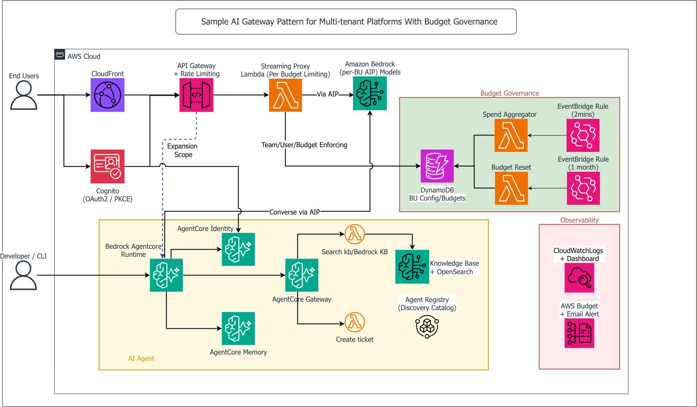

# Token Sovereignty: Sample AI Gateway for Enterprise Amazon Bedrock Governance

This sample code (not production ready) shows patterns for how to treat each business unit as a tenant — with its own identity, model entitlement, cost attribution, and spend cap — built on top of Amazon Bedrock using AWS native services. It demonstrates four governance capabilities across a shared multi-tenant gateway: **rate limiting** (via Amazon API Gateway usage plans to protect against both tenant overuse and external abuse — throttling at the API level limits blast radius from runaway clients or malicious traffic before it reaches Bedrock), **per-tenant cost attribution and hard budget enforcement** (Application Inference Profiles + real-time spend tracking that blocks calls when a team's monthly dollar cap is reached), **OAuth2 authentication** (Cognito with PKCE for browser users, M2M client credentials for agents), and **agentic tool invocation** (end-to-end AgentCore integration — Gateway, Runtime, Identity, Memory, and Agent Registry all wired together with a deployable Strands-based IT support agent).

The sample is fully deployable — CloudFormation stacks, a React chat frontend, AgentCore wiring scripts, a containerized Strands agent, and a CloudWatch observability dashboard are all included. Deployment and test scripts let you stand up the full stack and validate governance controls end to end in under an hour.

> **Note:** Amazon Bedrock AgentCore Gateway (Aug 2026) now supports native rate limiting by request, token, and connection throughput, along with inbound OAuth2/JWT auth and direct inference targets. For many governance scenarios, that's the right starting point. See the [AgentCore Gateway rate limiting announcement](https://aws.amazon.com/blogs/machine-learning/configure-rate-limits-for-ai-traffic-on-agentcore-gateway/) for details.

This sample implements a complementary pattern focused on **dollar-based budget enforcement per business unit** — where teams are allocated a monthly spend cap and calls are blocked once the cap is reached, across both a streaming chat path and an AgentCore agent path, from a single shared config table.

> **Note**: After running `deploy.sh`, the deployment summary prints your specific CloudFront URL, Gateway URL, and login credentials.

---

## Architecture



The gateway supports two invocation paths:

- **Browser / Chat path** — End users authenticate via Cognito OAuth2/PKCE, send chat requests through API Gateway, and the Streaming Proxy Lambda routes them to Amazon Bedrock via per-BU Application Inference Profiles using `ConverseStream`.
- **Developer / Agent path** — Developers or automated systems invoke the AgentCore Runtime directly via SigV4/IAM. The Strands-based agent retrieves a Cognito M2M token from the Identity token vault, recalls cross-session memory, calls Bedrock via `Converse`, and invokes tools (KB search, ticket creation) through the AgentCore MCP Gateway.

Both paths enforce per-BU spend caps via DynamoDB and emit metrics to CloudWatch for real-time cost attribution. See [ARCHITECTURE.md](ARCHITECTURE.md) for the full component breakdown and data flows.

---

## Prerequisites

| Tool | Version | Purpose |
|------|---------|---------|
| AWS CLI | **≥ 2.28** (recommended: 2.32+) | Infrastructure + AgentCore (`bedrock-agentcore-control` / `bedrock-agentcore`) |
| Python | 3.11+ | Scripts and Lambda functions |
| Node.js | 18+ | Client UI build |
| Docker or Finch | Docker with buildx / Finch v1+ | Build the ARM64 demo-agent image for AgentCore Runtime (Step 12) |
| jq | any | JSON processing in scripts |

### AWS CLI Version Requirement (Critical)

The AgentCore features (Steps 5, 5a, 5b, 12, 12a) require the `bedrock-agentcore-control` and `bedrock-agentcore` services, which were added to AWS CLI in **v2.28**. If your CLI is older, these steps will be silently skipped during deployment.

**Check your version:**
```bash
aws --version
# Must be >= 2.28.0 for AgentCore support
```

**Upgrade on macOS (ARM64 / Apple Silicon):**
```bash
curl "https://awscli.amazonaws.com/AWSCLIV2.pkg" -o "/tmp/AWSCLIV2.pkg"
sudo installer -pkg /tmp/AWSCLIV2.pkg -target /
aws --version   # Should show 2.28+ after upgrade
```

**Upgrade on macOS (Homebrew):**
```bash
brew upgrade awscli
```

**Upgrade on Linux (x86_64):**
```bash
curl "https://awscli.amazonaws.com/awscli-exe-linux-x86_64.zip" -o "/tmp/awscliv2.zip"
unzip -o /tmp/awscliv2.zip -d /tmp
sudo /tmp/aws/install --update
```

**Verify AgentCore service is available after upgrade:**
```bash
aws bedrock-agentcore-control list-gateways --region us-east-1 --max-results 1
# Success = empty list or gateways; Failure = "Invalid choice" error
```

> **If you cannot upgrade the CLI**: The Python scripts (Steps 5a, 5b, 12a) use boto3 directly and work with `boto3>=1.35`. Only the shell scripts (`register-tools.sh`, `deploy-demo-agent.sh`) require the CLI. Install the latest boto3: `pip3 install 'boto3>=1.43'`.

**Python packages** (install before running either phase):
```bash
pip3 install boto3 botocore requests opensearch-py requests-aws4auth
# For AgentCore features (Identity, Memory, Registry, demo agent):
pip3 install 'boto3>=1.43' 'bedrock-agentcore[strands-agents]>=1.0.3'
```

### Agent Registry Enrollment (Preview Feature)

AWS Agent Registry (Step 12a) is a preview feature that requires account-level activation before the API is accessible — even for users with `AdministratorAccess`. Without enrollment, Step 12a fails with `AccessDeniedException` on `bedrock-agentcore:ListRegistries`, which looks identical to an IAM error but is actually a service enrollment gate.

Refer to the [AWS Agent Registry documentation](https://docs.aws.amazon.com/bedrock/latest/userguide/agent-registry.html) for current activation steps, as the onboarding process is actively evolving. Step 12a degrades gracefully if not enrolled — the rest of the deployment completes. See `docs/IAM-PERMISSIONS.md` for the required IAM actions once enrolled.

---

## Deployment Overview

Deployment is split into two phases because OpenSearch Serverless collections take **10-15 minutes** to become ACTIVE, and the Bedrock Knowledge Base cannot be created until the collection is ready.

```
Phase 1: deploy.sh          →  wait 10-15 min  →  Phase 2: deploy-phase2.sh
(CloudFormation stacks,                           (OpenSearch index, KB,
 frontend, Cognito, CORS)                          data source, ingestion)
```

---

## Phase 1: Infrastructure Deployment

### Before you run

```bash
export AWS_PROFILE=<your-aws-profile>   # e.g. webapps
```

**If you are using Finch** (required for Step 12 — building the ARM64 demo agent image), start it before running deploy.sh:
```bash
finch vm start   # first time: finch vm init
```

To verify it's running:
```bash
finch info       # should print server info without errors
```

If you're using Docker instead, just ensure Docker Desktop is running before you start.

### Run deploy.sh

```bash
./deploy.sh --region us-east-1 --stage poc --alert-email team@company.com --temp-password 'TempPass@2026!'
```

> ⚠️ **Pass `--temp-password` upfront.** Step 11 creates Cognito users and requires a temporary password. If you omit this flag the script will pause mid-run and prompt interactively — easy to miss when the terminal is scrolling. Pass it on the command line so the script runs unattended from start to finish. Cognito forces a password change on first login, so this value is only used once.

**Parameters:**

| Parameter | Required | Description |
|-----------|----------|-------------|
| `--region` | Yes | AWS region to deploy into (e.g., `us-east-1`) |
| `--stage` | Yes | Deployment stage name (use `poc`). Must be lowercase alphanumeric with hyphens only — no underscores or uppercase (e.g. `poc`, `dev`, `staging`). Uppercase or underscores will cause the Cognito domain creation to fail. |
| `--alert-email` | Yes | Email for budget alert notifications and the admin Cognito username |
| `--temp-password` | **Yes** | Temporary password for new Cognito users (Step 11). Must meet Cognito requirements: 8+ chars, uppercase, lowercase, number, symbol. Example: `TempPass@2026!` |

### What Phase 1 deploys

1. Deploys AI Gateway CloudFormation stack (API Gateway + Cognito + Streaming Lambda)
2. Enables Bedrock invocation logging for cost tracking
3. Creates Application Inference Profiles (AIPs) per business unit for cost attribution
4. Deploys custom Lambda tools stack — OpenSearch Serverless collection + `search_kb` + `create_ticket` Lambdas (**no KB in CloudFormation**)
5. Registers the two Lambdas as MCP tools in an **AgentCore Gateway** (semantic discovery + Cognito JWT auth) via `scripts/register-tools.sh`
6. Deploys frontend infrastructure (S3 + CloudFront)
7. Configures Cognito Hosted UI with OAuth2/PKCE callback URLs
8. Builds React frontend and uploads to S3
9. Configures CORS on API Gateway
10. Creates your admin Cognito user and an IT-Operations test user (`demo-itops@example.com`) for BU cost attribution testing
11. Creates AWS Budget alert ($500/month threshold)
12. Deploys CloudWatch observability dashboard
13. Builds the ARM64 demo-agent image and deploys it to **AgentCore Runtime** (requires Docker with buildx or Finch; skipped automatically if unavailable)
14. Writes all deployed resource IDs to `.env.md` (gitignored) for local reference

> **AgentCore steps (5 & 13)** use the `aws bedrock-agentcore-control` service. Each step
> degrades gracefully: if the service is unavailable (old CLI) or Docker isn't running,
> deploy.sh prints the exact manual command to run later and continues. See the AgentCore
> section below for details.

### After Phase 1 — wait for OpenSearch

After `deploy.sh` completes, the OpenSearch Serverless collection needs time to become ACTIVE. Check its status:

```bash
aws opensearchserverless batch-get-collection \
  --names ai-gateway-kb-poc \
  --region us-east-1 \
  --query 'collectionDetails[0].status'
```

Wait until this returns `"ACTIVE"` (typically 10-15 minutes), then proceed to Phase 2.

---

## Phase 2: Knowledge Base Setup

Phase 2 creates the Bedrock Knowledge Base, uploads documents, and triggers ingestion. It must run **after** the OpenSearch collection from Phase 1 is ACTIVE.

### Before you run

```bash
# Verify opensearch-py is installed
pip3 install opensearch-py requests-aws4auth
```

### Run deploy-phase2.sh

```bash
./deploy-phase2.sh --region us-east-1 --stage poc
```

**Parameters:**

| Parameter | Required | Description |
|-----------|----------|-------------|
| `--region` | Yes | Same region used in Phase 1 |
| `--stage` | Yes | Same stage used in Phase 1 (e.g., `poc`) |

### What Phase 2 does

1. Reads stack outputs from `ai-gateway-mcp-tools-poc` to get collection ARN, endpoint, KB role ARN, S3 bucket name, and Lambda function name
2. Checks OpenSearch collection status — exits with instructions if not yet ACTIVE
3. Creates the vector index `bedrock-knowledge-base-default-index` in the collection using `opensearch-py`
4. Creates the Bedrock Knowledge Base via `aws bedrock-agent create-knowledge-base`
5. Creates the data source pointing to the S3 bucket
6. Uploads KB documents from `custom-lambdas/kb-docs/` to S3
7. Starts the ingestion job and polls until complete
8. Updates the `search_kb` Lambda environment variable with the real KB ID
9. Prints a success summary with the KB ID

The script is **idempotent** — if a KB with the same name already exists, it skips creation and only updates the Lambda env var.

### Example CLI commands (for reference)

These are the exact commands `deploy-phase2.sh` runs. Resource IDs will differ per deployment.

**Create vector index:**
```bash
pip3 install opensearch-py requests-aws4auth
python3 scripts/create-opensearch-index.py \
  --endpoint https://uyca40fv6fqv96laj5sg.us-east-1.aoss.amazonaws.com \
  --region us-east-1
```

**Create Knowledge Base:**
```bash
aws bedrock-agent create-knowledge-base \
  --name "ai-gateway-kb-poc" \
  --role-arn "<kb-role-arn-from-stack-outputs>" \
  --knowledge-base-configuration '{"type":"VECTOR","vectorKnowledgeBaseConfiguration":{"embeddingModelArn":"arn:aws:bedrock:us-east-1::foundation-model/amazon.titan-embed-text-v1"}}' \
  --storage-configuration '{"type":"OPENSEARCH_SERVERLESS","opensearchServerlessConfiguration":{"collectionArn":"<collection-arn>","vectorIndexName":"bedrock-knowledge-base-default-index","fieldMapping":{"vectorField":"bedrock-knowledge-base-default-vector","textField":"AMAZON_BEDROCK_TEXT_CHUNK","metadataField":"AMAZON_BEDROCK_METADATA"}}}' \
  --region us-east-1
```

**Create data source:**
```bash
aws bedrock-agent create-data-source \
  --knowledge-base-id "<kb-id>" \
  --name "ai-gateway-kb-docs" \
  --data-source-configuration '{"type":"S3","s3Configuration":{"bucketArn":"arn:aws:s3:::ai-gateway-kb-docs-<account-id>"}}' \
  --region us-east-1
```

**Upload documents and trigger ingestion:**
```bash
aws s3 sync custom-lambdas/kb-docs/ s3://ai-gateway-kb-docs-<account-id>/ --region us-east-1

aws bedrock-agent start-ingestion-job \
  --knowledge-base-id "<kb-id>" \
  --data-source-id "<data-source-id>" \
  --region us-east-1
```

**Update Lambda env var:**
```bash
aws lambda update-function-configuration \
  --function-name "<search-kb-lambda-name>" \
  --environment "Variables={KNOWLEDGE_BASE_ID=<kb-id>}" \
  --region us-east-1
```

---

## First Login

After both phases complete:

1. Open the **CloudFront URL** printed by `deploy.sh`
2. Click **Sign In** — redirects to the Cognito Hosted UI
3. Enter your email and temporary password (`TempPass@2026!`)
4. Cognito prompts you to set a new password — choose a strong password
5. After password change, you're redirected back to the chat interface
6. Start chatting with **Claude Sonnet 4.6** (`us.anthropic.claude-sonnet-4-6`) through the AI Gateway

> ⚠️ **Before running tests**, the password change in step 4 must be completed. Tests authenticate via `ADMIN_NO_SRP_AUTH` which requires `CONFIRMED` status — the account stays in `FORCE_CHANGE_PASSWORD` until you log in via the browser. The test pre-flight check will catch this and print the exact fix if you forget.

Set these before running tests:
```bash
export COGNITO_USERNAME="<your-email>"
export COGNITO_PASSWORD='<the-password-you-set-in-step-4>'
export AWS_PROFILE=<your-aws-profile>
./tests/run-all-tests.sh
```

---

## Post-Deployment: Enable Cost Allocation Tags (Manual)

This step enables cost filtering by `CostCenter` in AWS Cost Explorer. It requires access to the **AWS Organization management/payer account** and cannot be automated from the member account.

1. Sign in to the **management/payer account**
2. Go to **Billing** → **Cost Allocation Tags** → **User-defined cost allocation tags** tab
3. Find `CostCenter` → check the box → click **Activate**
4. Wait **24 hours** for tags to appear in Cost Explorer
5. Then in Cost Explorer: Group by **Tag: CostCenter**, filter to `IT-Operations`

> This step is only needed once per Organization. If your billing admin has already activated `CostCenter` as a cost allocation tag, skip this step.

---

## Business Unit Cost Attribution and Model Entitlement

Every model call is attributed to the caller's business unit, and the same configuration
decides which models that business unit is allowed to use. Both the browser chat path and
the AgentCore agent read one table, so entitlement and chargeback cannot drift apart.

**`config/bu-models.json` is the file you edit.** It declares the business units, the
models each is entitled to, which model is its default, and the per-model prices used for
the dashboard cost estimates.

An Application Inference Profile wraps exactly one model, so there is one profile per
`(business unit, model)` pair. Bedrock emits token metrics per profile, which is what
makes the per-BU split visible in CloudWatch within a couple of minutes rather than after
a billing cycle.

### How a request gets attributed

| | Chat plane (browser) | Agent plane (AgentCore Runtime) |
|---|---|---|
| Business unit from | `custom:team` in the validated Cognito token | `business_unit` in the invoke payload |
| Model from | the URL path, `/v1/model/{modelId}/...` | optional `model` in the payload, else the BU default |
| Not entitled | `403` | error response, no model call made |
| Trustworthy? | Yes — the caller cannot forge the claim | No — asserted by the caller, see below |

> **Trust boundary.** The runtime uses IAM (SigV4) inbound auth with no JWT authorizer, so
> `business_unit` on the agent plane is asserted by the caller rather than verified. Only
> IAM principals trusted to declare their own cost center should hold
> `bedrock-agentcore:InvokeAgentRuntime`. To make it verifiable, attach a Cognito JWT
> authorizer to the runtime and read `custom:team` from the validated token instead.

### Adding a business unit or a model

Edit `config/bu-models.json`, then:

```bash
./scripts/create-aips.sh us-east-1              # create any missing inference profiles
./scripts/create-team-config-table.sh us-east-1 # reseed the routing table
python scripts/update-dashboard.py              # regenerate the per-BU dashboard widgets
```

All three are idempotent. No application code changes and no redeploy of the gateway or
the agent are needed — unless you change `agent.py`, which does require
`scripts/deploy-demo-agent.sh`.

### Per-BU Budget Enforcement

Each business unit has a `budget_limit` (USD/month) in `config/bu-models.json`. Spend is tracked by the **SpendAggregatorLambda** — an event-driven Lambda that runs every 2 minutes, completely independent of the Streaming Proxy:

- Reads the team→AIP profile mapping **dynamically from DynamoDB** (no hardcoding)
- Queries `AWS/Bedrock` CloudWatch metrics per AIP profile (same source as the dashboard)
- Sums cost per team and writes `month_spend` to DynamoDB
- The Streaming Proxy Lambda **only reads** `month_spend` for the pre-request budget check

Requests are **blocked with HTTP 429** before calling Bedrock when `month_spend >= budget_limit`. There is up to a 2-minute window where a team slightly over budget can still make calls — acceptable for monthly budgets ($5,000 = < $0.001 possible overshoot).

Spend resets on the 1st of each month via `BudgetResetLambda` (EventBridge cron). `budget_limit = 0` means unlimited.

**Error shown in the UI when budget is exceeded:**
> ⛔ Team 'Architecture' has exceeded its monthly budget ($0.09 / $0.05). Budget resets on the 1st of next month. Please contact your administrator to increase your budget limit.

**Check or adjust live spend counters:**
```bash
# View current spend vs limit for all teams (updated every 2 min)
aws dynamodb scan --table-name ai-gateway-team-config \
  --projection-expression "team, budget_limit, month_spend" \
  --query "Items[].{team:team.S, limit:budget_limit.N, spend:month_spend.N}" \
  --output table

# Change a team's budget limit immediately (no redeploy needed)
aws dynamodb update-item --table-name ai-gateway-team-config \
  --key '{"team":{"S":"Architecture"}}' \
  --update-expression "SET budget_limit = :bl" \
  --expression-attribute-values '{":bl":{"N":"5000"}}'
```

**Test enforcement end-to-end:**
```bash
python3 tests/test-budget-enforcement.py \
  --gateway-url "$GATEWAY_URL" --api-key "$API_KEY" \
  --user-pool-id "$USER_POOL_ID" --test-client-id "$TEST_CLIENT_ID" \
  --username "$COGNITO_USERNAME" --password "$COGNITO_PASSWORD"

# Live walkthrough with token and cost numbers, for a demo:
python scripts/demo-bu-attribution.py

# Cost table only, no invocations:
python scripts/demo-bu-attribution.py --metrics
```
```

`docs/observability-guide.md` covers the CloudWatch dimensions, the Cost Explorer tag
limitation, and the failure modes worth knowing about.

> **Caveat on coverage.** All agent *reasoning* spend is attributed. AgentCore Memory runs
> its own service-managed model calls for the extraction and summarisation strategies, and
> KB retrieval uses a Titan embedding model; neither appears under a business unit's
> profile. Both are small, but "100% of agent spend is attributed" would be an overclaim.

---

## AgentCore: MCP Gateway + Demo Agent (Feature 4)

Feature 4 registers the two custom Lambdas as MCP tools in an **AgentCore Gateway** and
deploys a Strands **demo agent** to **AgentCore Runtime** that discovers and calls those
tools. Both are wired automatically by `deploy.sh` (Steps 4 and 11) but can be run
standalone.

### Architecture

```
Demo Agent (Strands, AgentCore Runtime, ARM64 container)
  │  Cognito M2M token (client_credentials)
  ▼
AgentCore Gateway  ──(MCP, semantic discovery)──►  Lambda targets
  authorizer: CUSTOM_JWT (Cognito user pool)        ├── search-kb___search_kb
  outbound:   GATEWAY_IAM_ROLE                       └── create-ticket___create_ticket
```

- **Auth:** the gateway uses a `CUSTOM_JWT` authorizer pointed at the POC's Cognito user
  pool. A dedicated machine-to-machine app client (`ai-gateway-agent-m2m`, client
  credentials grant, scope `ai-gateway/invoke`) lets the agent mint a bearer token.
- **Tool names:** gateway targets prefix the tool name with the target name, so the tools
  are exposed as `search-kb___search_kb` and `create-ticket___create_ticket`.
- **Connection details** (gateway URL, M2M client id/secret, token endpoint, runtime ARN)
  are written to `.agentcore-config.json` at the repo root. **This file holds a secret and
  is gitignored** — the demo agent and tests read it.

### Register the gateway and tools (Step 4)

```bash
bash scripts/register-tools.sh \
  ai-gateway-poc \
  <search-kb-lambda-arn> \
  <create-ticket-lambda-arn> \
  <cognito-user-pool-id>
```

Creates (idempotently): the gateway service IAM role, a Cognito resource server + M2M app
client, the MCP gateway with semantic discovery, and one Lambda target per tool. Writes
`.agentcore-config.json`.

### Deploy the demo agent (Step 11)

```bash
bash scripts/deploy-demo-agent.sh
```

Builds `custom-lambdas/demo-agent/` as a **linux/arm64** image, pushes it to ECR, creates an
execution role, and calls `CreateAgentRuntime` with the gateway connection details injected
as environment variables. Requires Docker with buildx or Finch.

Invoke the deployed agent (pass the payload as a **file** — the CLI base64-mangles inline blobs):

```bash
echo '{"prompt":"Find documents about tire pressure monitoring"}' > /tmp/payload.json
aws bedrock-agentcore invoke-agent-runtime \
  --agent-runtime-arn <arn-from-.agentcore-config.json> \
  --payload fileb:///tmp/payload.json \
  --region us-east-1 /dev/stdout
```

Or run the agent locally against the gateway (no Runtime needed):

```bash
cd custom-lambdas/demo-agent
pip install -r requirements.txt
# export GATEWAY_* vars from .agentcore-config.json, then:
python agent.py
```

---

## AgentCore: Identity, Memory, and Agent Registry

Beyond the Gateway + Runtime spine, the POC implements three additional AgentCore
primitives. Each has an idempotent setup script that writes its identifiers into
`.agentcore-config.json`, and `deploy-demo-agent.sh` injects them into the runtime
automatically when present.

### AgentCore Identity (token vault)

```bash
python3 scripts/setup-agentcore-identity.py
```

Creates a **workload identity** (`ai-gateway-it-support-agent`) and a **Custom
OAuth2 credential provider** (`ai-gateway-cognito`) that stores the
Cognito M2M client id/secret in the AgentCore **token vault**. At runtime the
agent fetches its gateway bearer token from the vault (env var
`GATEWAY_OAUTH_PROVIDER`) instead of carrying `GATEWAY_CLIENT_SECRET` in plaintext.
Locally — outside the Runtime workload context — the agent transparently falls
back to the direct Cognito `client_credentials` request.

### AgentCore Memory (cross-session persistence)

```bash
python3 scripts/setup-agentcore-memory.py
```

Creates a Memory resource (`ai_gateway_it_support_memory`) with three long-term
strategies: **user preferences** (`/preferences/{actorId}`), **semantic facts**
(`/facts/{actorId}`), and **session summaries** (`/summaries/{actorId}/{sessionId}`).
The agent attaches a Strands `AgentCoreMemorySessionManager` when
`AGENTCORE_MEMORY_ID` is set, so conversations persist and the agent recalls user
context across sessions. Test it locally:

```bash
# Session 1 — teach it something (override actor/session IDs to simulate users):
AGENT_ACTOR_ID=alice AGENT_SESSION_ID=s1 python agent.py
#   You: My name is Alice and I manage the Nashville plant on Cisco AnyConnect.
# Session 2 — brand-new session, same actor — it remembers:
AGENT_ACTOR_ID=alice AGENT_SESSION_ID=s2 python agent.py
#   You: Which plant do I manage and what VPN do we use?
```

### AWS Agent Registry (governed discovery)

```bash
python3 scripts/setup-agent-registry.py
```

Publishes the agent and its tools into **AWS Agent Registry** — a governed,
searchable catalog (preview). Creates a registry (`ai-gateway-agent-registry`)
and two records:

- **MCP record** (`ai-gateway-it-support-tools`) — the gateway's MCP server and
  its `search_kb` / `create_ticket` tools (validated against the MCP server.json
  and tools schemas).
- **A2A Agent record** (`ai-gateway-it-support-agent`) — the demo agent's A2A
  Agent Card (capabilities + skills).

Records auto-approve and become discoverable via semantic search:

```bash
aws bedrock-agentcore search-registry-records \
  --registry-ids <registryId-from-.agentcore-config.json> \
  --search-query "create an incident ticket" --region us-east-1
```

> These setup scripts use boto3 directly because the registry/identity/memory
> control-plane APIs require a newer AWS CLI than the bundled 2.32. Install with
> `pip install 'boto3>=1.43' 'bedrock-agentcore[strands-agents]'`.

---

## Validation

### Run all tests (recommended)

All deployment values (gateway URL, API key, user pool ID, test client ID) are resolved
**dynamically** from CloudFormation stack outputs and AWS API calls — no resource IDs or
credentials need to be hardcoded. Only your Cognito credentials are required:

```bash
export AWS_PROFILE=<your-aws-profile>
export COGNITO_USERNAME="<your-cognito-email>"
export COGNITO_PASSWORD='<your-cognito-password>'
./tests/run-all-tests.sh
```

Credentials are in `.env.md` at the repo root (gitignored).

### Run individual tests

```bash
# Authentication (tests 401 without token, 200 with valid token + API key)
./tests/test-auth.sh "$GATEWAY_URL" "$USER_POOL_ID" "$TEST_CLIENT_ID" \
  "$COGNITO_USERNAME" "$COGNITO_PASSWORD" us-east-1 webapps "$API_KEY"

# Rate limiting (temporarily lowers rate to 1 req/sec, sends burst, checks 429s)
./tests/test-rate-limiting.sh "$GATEWAY_URL" "$API_KEY" "$USER_POOL_ID" "$TEST_CLIENT_ID" \
  "$COGNITO_USERNAME" "$COGNITO_PASSWORD" us-east-1 webapps

# Cost tracking (50 invocations, checks CloudWatch for token/model data)
python3 tests/test-cost-tracking.py --gateway-url "$GATEWAY_URL" --api-key "$API_KEY" \
  --user-pool-id "$USER_POOL_ID" --test-client-id "$TEST_CLIENT_ID" \
  --username "$COGNITO_USERNAME" --password "$COGNITO_PASSWORD"

# MCP tools — Lambda mode (no AgentCore gateway dependency)
python3 tests/test-mcp-tools.py --mode lambda

# Budget enforcement (sets $0.01 limit, triggers 429, resets, restores)
python3 tests/test-budget-enforcement.py \
  --gateway-url "$GATEWAY_URL" --api-key "$API_KEY" \
  --user-pool-id "$USER_POOL_ID" --test-client-id "$TEST_CLIENT_ID" \
  --username "$COGNITO_USERNAME" --password "$COGNITO_PASSWORD"

# AgentCore primitives (Identity, Memory, Registry, demo agent E2E)
python3 tests/test-agentcore.py
```

See `tests/scorecard-validation.md` for the full scoring breakdown and per-criterion pass/fail criteria.

---

## Test Scenario: AgentCore End-to-End

This walkthrough exercises the full AgentCore feature set — Gateway + Runtime,
Identity (token vault), Memory (cross-session persistence), and Agent Registry
(discovery) — end to end. It assumes both deploy phases have completed and
`.agentcore-config.json` holds the gateway, identity, memory, runtime, and
registry identifiers.

### 1. Invoke the agent

Send a prompt that forces a tool call. Pass the payload as a **file** — the CLI
base64-mangles inline blobs:

```bash
echo '{"prompt":"Find documents about tire pressure monitoring"}' > /tmp/payload.json
aws bedrock-agentcore invoke-agent-runtime \
  --agent-runtime-arn "$(jq -r .agentRuntimeArn .agentcore-config.json)" \
  --payload fileb:///tmp/payload.json \
  --region us-east-1 /dev/stdout
```

The response is a JSON object with `response`, `session_id`, `actor_id`, and
`memory_enabled` fields. A non-empty `response` confirms the Runtime invoked the
agent, fetched its gateway bearer token from the **Identity token vault** (no
client secret in the runtime env), and reached the MCP Gateway.

### 2. Verify tool usage via logs

Confirm the agent actually called an MCP tool by inspecting the runtime log group.
The runtime id is the suffix of `agentRuntimeArn`:

```bash
RUNTIME_ID=$(jq -r .agentRuntimeId .agentcore-config.json)
aws logs tail "/aws/bedrock-agentcore/runtime/$RUNTIME_ID" \
  --since 10m --region us-east-1 \
  --filter-pattern "search_kb"
```

Look for the tool name (`search-kb___search_kb` or `create-ticket___create_ticket`)
in the log lines. You can also tail the MCP gateway log group to see the inbound
tool invocation from the gateway side.

### 3. Test memory persistence across sessions

Memory keys on `actor_id` + `session_id`. Teach the agent something in one session,
then start a brand-new session with the **same actor** and confirm it recalls the
earlier context:

```bash
# Session 1 — teach it a fact
echo '{"prompt":"My name is Alice and I manage the Nashville plant on Cisco AnyConnect.","actor_id":"alice","session_id":"s1"}' > /tmp/s1.json
aws bedrock-agentcore invoke-agent-runtime \
  --agent-runtime-arn "$(jq -r .agentRuntimeArn .agentcore-config.json)" \
  --payload fileb:///tmp/s1.json --region us-east-1 /dev/stdout

# Session 2 — new session, same actor — it remembers
echo '{"prompt":"Which plant do I manage and what VPN do we use?","actor_id":"alice","session_id":"s2"}' > /tmp/s2.json
aws bedrock-agentcore invoke-agent-runtime \
  --agent-runtime-arn "$(jq -r .agentRuntimeArn .agentcore-config.json)" \
  --payload fileb:///tmp/s2.json --region us-east-1 /dev/stdout
```

The Session 2 `response` should reference the Nashville plant and Cisco AnyConnect,
even though it was a different `session_id`. You can also inspect stored memory
records directly:

```bash
aws bedrock-agentcore retrieve-memory-records \
  --memory-id "$(jq -r .memory.memoryId .agentcore-config.json)" \
  --namespace "/facts/alice" \
  --search-criteria '{"searchQuery":"Nashville plant VPN"}' \
  --region us-east-1
```

### 4. Test registry discovery

Confirm the agent and its tools are discoverable in the Agent Registry via semantic
search:

```bash
aws bedrock-agentcore search-registry-records \
  --registry-ids "$(jq -r .registry.registryId .agentcore-config.json)" \
  --search-query "create an incident ticket" \
  --region us-east-1
```

The query should return the MCP record (`ai-gateway-it-support-tools`). Searching
for "IT support" returns the A2A agent record (`ai-gateway-it-support-agent`).

### 5. Run the automated test

`tests/test-agentcore.py` bundles all of the above into pass/fail checks. It reads
`.agentcore-config.json` and skips any check whose resources are not deployed:

```bash
python3 tests/test-agentcore.py --region us-east-1 --profile "$AWS_PROFILE"
```

It validates identity token-vault retrieval (no client secret), memory persistence
across two invocations sharing `session_id`/`actor_id`, registry discovery via
`search-registry-records`, and the demo-agent end-to-end response shape (`response`,
`session_id`, `actor_id`, `memory_enabled`).

---

## Cleanup

Remove all deployed resources to stop incurring charges:

```bash
./cleanup/destroy.sh --region us-east-1 --stage poc
```

This deletes all CloudFormation stacks, empties and removes S3 buckets, disables and deletes the CloudFront distribution, removes AgentCore Gateway resources, and deletes the Bedrock Knowledge Base.

---

## Documentation

| Document | Description |
|----------|-------------|
| [ARCHITECTURE.md](ARCHITECTURE.md) | System architecture, data flows, component inventory |
| [docs/IAM-PERMISSIONS.md](docs/IAM-PERMISSIONS.md) | IAM roles and least-privilege policies |
| [docs/entra-id-integration.md](docs/entra-id-integration.md) | Swap Cognito for Azure Entra ID in production |
| [docs/multi-cloud-extension.md](docs/multi-cloud-extension.md) | Add LiteLLM for Azure OpenAI + Databricks routing |
| [docs/troubleshooting.md](docs/troubleshooting.md) | Common deployment issues and fixes |

---

## Project Structure

```
├── deploy.sh                    # Phase 1: infrastructure deployment
├── deploy-phase2.sh             # Phase 2: Knowledge Base setup (run after OpenSearch is ACTIVE)
├── cleanup/destroy.sh           # Full resource teardown
├── config/                      # POC configuration files
│   ├── bu-models.json           # Business unit → entitled models matrix + pricing
│   ├── usage-plans.json         # Rate limiting settings
│   ├── bedrock-project.json     # Cost allocation tags
│   ├── cognito-setup.json       # Auth configuration
│   └── gateway-tools.json       # MCP tool schemas
├── scripts/                     # Deployment helper scripts
│   ├── create-aips.sh           # One inference profile per (business unit, model)
│   ├── create-team-config-table.sh  # Seeds the BU routing table from the matrix
│   ├── update-dashboard.py      # Generates the per-BU dashboard widgets
│   └── demo-bu-attribution.py   # Live cost attribution walkthrough
├── custom-lambdas/              # Lambda functions + KB docs
│   ├── template.yaml            # CloudFormation (OpenSearch + Lambdas, no KB)
│   ├── demo-agent/agent.py      # AgentCore Runtime agent (resolves BU → profile)
│   └── kb-docs/                 # Documents uploaded to S3 for KB ingestion
├── cloudformation/              # CloudFormation templates
├── frontend/                    # React Client UI (branded)
│   ├── public/config.example.js # Template for the gitignored generated config.js
│   └── src/models.js            # Model ID config — uses us.anthropic.claude-sonnet-4-6
├── dashboards/                  # CloudWatch dashboard definition (static widgets only)
├── tests/                       # Validation test scripts
├── .aip-map.json                # (gitignored) generated (BU, model) → profile ARN map
└── docs/                        # Extended documentation
```

---

## Security Considerations

> ⚠️ **This is a sample project for evaluation and learning purposes only.** It is not hardened for production use. Review every item in this section before deploying to a production environment.

Several security controls are intentionally omitted to keep deployment simple. Before using this pattern in production:

| Area | Current state | Production recommendation |
|---|---|---|
| Lambda networking | Lambdas run outside a VPC | Deploy inside a VPC with private subnets and VPC endpoints for Bedrock/DynamoDB |
| Lambda resilience | No Dead Letter Queue on EventBridge-triggered Lambdas | Add SQS DLQ for `BudgetResetLambda` and `SpendAggregatorLambda` |
| Log encryption | CloudWatch Log Groups use default AWS-managed encryption | Encrypt with a customer-managed KMS key |
| WAF | CloudFront has no WAF attached | Add AWS WAF with rate-based rules and managed rule groups |
| Access logging | S3 buckets and CloudFront have no access logging | Enable S3 server access logging and CloudFront access logs to a dedicated logging bucket |
| Bedrock IAM | `InvokeModel` uses `Resource: "*"` | This is a Bedrock service limitation — resource-level ARN restrictions are not supported on `InvokeModel` |
| API caching | API Gateway caching is disabled | Enable caching for non-streaming, read-heavy workloads to reduce Bedrock calls and cost |
| CloudFront TLS | Uses CloudFront default certificate | Use a custom ACM certificate with a custom domain in production |
| Agent trust boundary | `business_unit` on the agent plane is caller-asserted, not verified | Add a Cognito JWT authorizer to the AgentCore Runtime and read `custom:team` from the validated token |
| Frontend build toolchain | `react-scripts@5.0.1` (Create React App) carries known CVEs | See **Frontend dependency vulnerabilities** below |

### Frontend dependency vulnerabilities

Running `npm audit` on the frontend reveals **15 known vulnerabilities** in transitive dependencies. The full detail, suppression rationale, and production recommendations are documented in [`docs/npm-audit-report.html`](docs/npm-audit-report.html).

**Summary:**

- **9 vulnerabilities were fixed** by running `npm audit fix`, which updated transitive dependency resolutions in `package-lock.json`.
- **15 vulnerabilities remain** across three groups. None are in code that ships to the browser in the production bundle, but they carry real residual risk:

**`react-router` (12 advisories, high severity)** — The patched version requires React 19; this project uses React 18, so the upgrade breaks the build. All 12 advisories require React Router Framework Mode (SSR, RSC, server actions) which this SPA does not use — but this is a code-level constraint, not a technical control. Any developer who adds SSR to this project inherits active high-severity vulnerabilities including an unauthenticated RCE vector.

**`svgo` (3 advisories, high severity)** — Locked inside `react-scripts → @svgr/webpack`. Runs at build time only — not in the browser. The vulnerable code executes during `npm run build`, so a malicious SVG file in the repo or a supply chain compromise of a build dependency could trigger it in CI/CD.

**`@tootallnate/once` (1 advisory, low severity)** — Inside the jest test runner chain. Runs during `npm test` only. Never in the production bundle.

**What to do before going to production:**

1. **Migrate the frontend from Create React App to Vite.** This eliminates the `svgo` and `@tootallnate/once` chains (artifacts of the old webpack/jest toolchain) and removes the React version ceiling blocking the react-router fix. A CRA-to-Vite migration for a project this size takes approximately 2–4 hours and is [well-documented](https://vitejs.dev/guide/migration).
2. **After migrating to Vite, upgrade React to `^19.0.0` and `react-router-dom` to `>=7.18.4`.** This resolves all 12 react-router advisories.
3. **Avoid adding SSR or React Router Framework Mode while on `react-router-dom@7.13.0`.** Enabling server-side rendering before upgrading activates high-severity vulnerabilities in the current version, including an unauthenticated RCE vector. Complete the Vite migration and React 19 upgrade first.
4. **Avoid using svgo as a runtime SVG sanitiser.** If SVG uploads are ever added to this app, svgo's `removeScripts` plugin has known bypass vulnerabilities that make it unreliable as a security control. [DOMPurify](https://github.com/cure53/DOMPurify) with SVG support is the appropriate tool for that use case.

---

## License

This project is licensed under the Apache-2.0 License.
